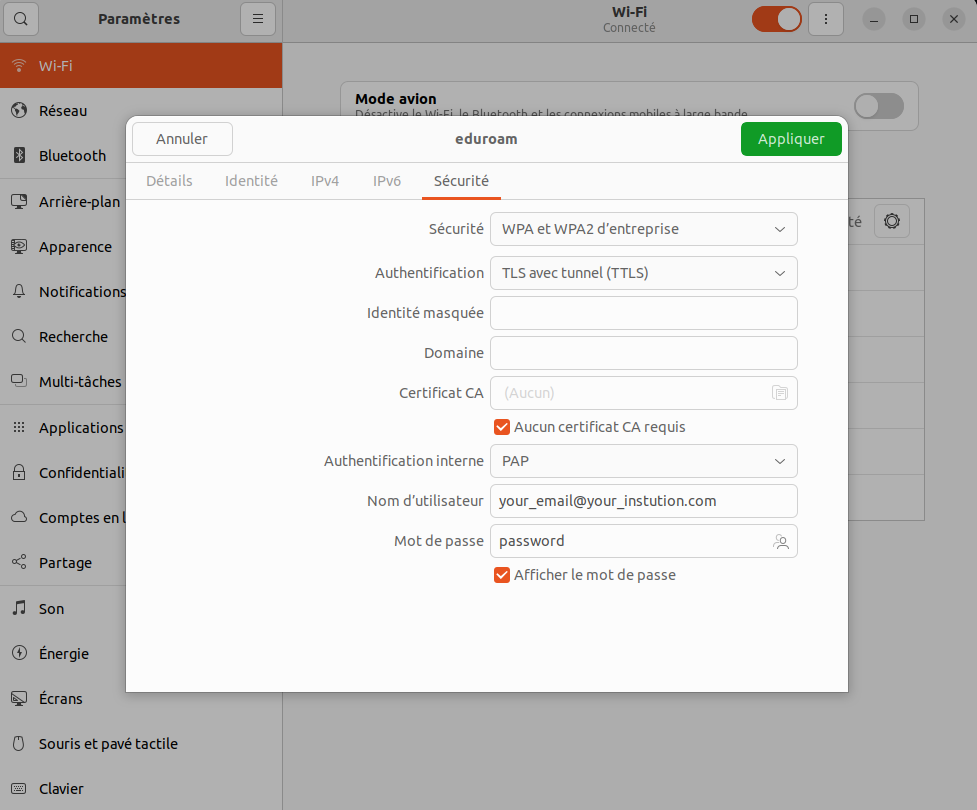

## Eduroam for Linux

Setting up Eduroam on your Linux distribution requires identifying your 'tutelle,' which refers to the institution providing your salary. Typically, for LOCEAN, this might be MNHN, CNRS, Sorbonne Université or IRD (but it works with any other institutions like Lille University for my case). To proceed, you'll need your institution's email account and its associated password. Instructions for this step can usually be found in the other tutorials, as they are not specific to Linux.
Follow these steps to install Eduroam:
1. Visit the [Eduroam installer](https://cat.eduroam.org/#), locate your institution and download the installer tailored for your distribution (you should get .py script for Linux).
1. Run the downloaded Python script 
``` shell
python ./eduroam-linux-UdL.py
```
and follow the provided instructions, entering your institution's email account and password when prompted.
1. Access your Wi-Fi settings, locate the Eduroam network, and configure the settings as depicted in the provided image for Wi-Fi configuration. 

 Apply the updated settings.

By following these steps, Eduroam should now be set up and ready to use on your Linux system.

